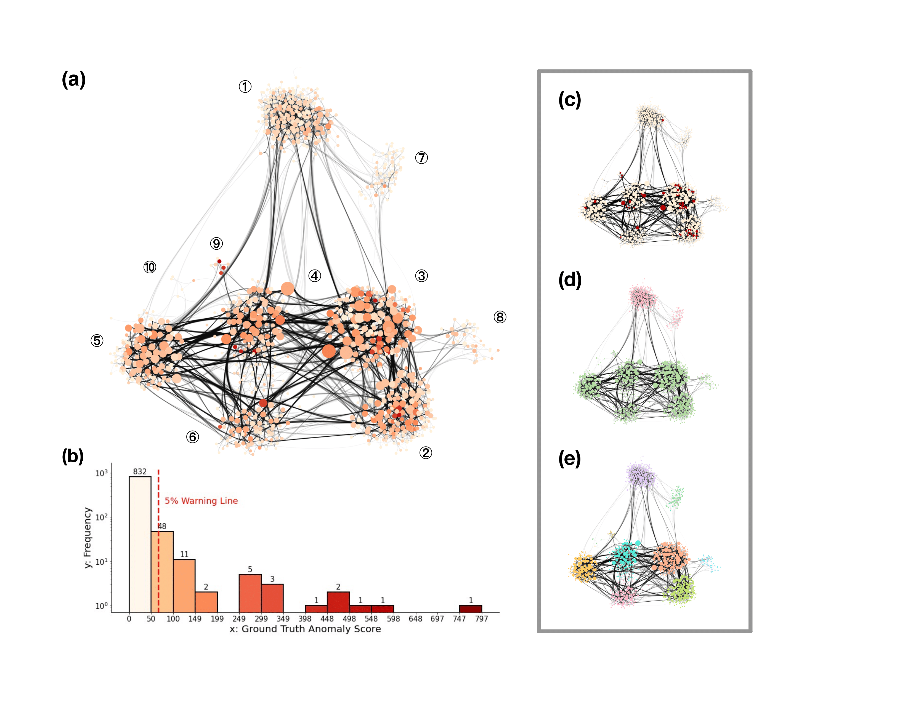

# Hi there 👋

> My name is Yueting Han. I am currently a MSc student from [MathSys CDT](https://warwick.ac.uk/fac/sci/mathsys/) at University of Warwick. My main research interest is mathematical modelling of social network, keen on network visualization!

&nbsp;

## Technologies and Tools

&nbsp;

## Network Visualization Highlights

- Community Detection
    

