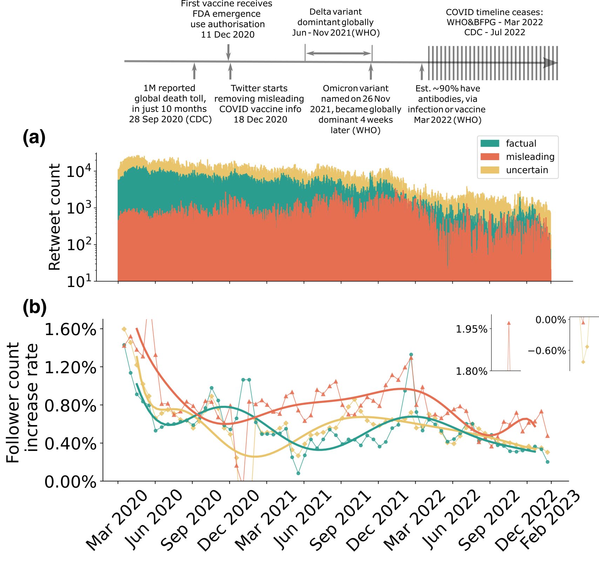
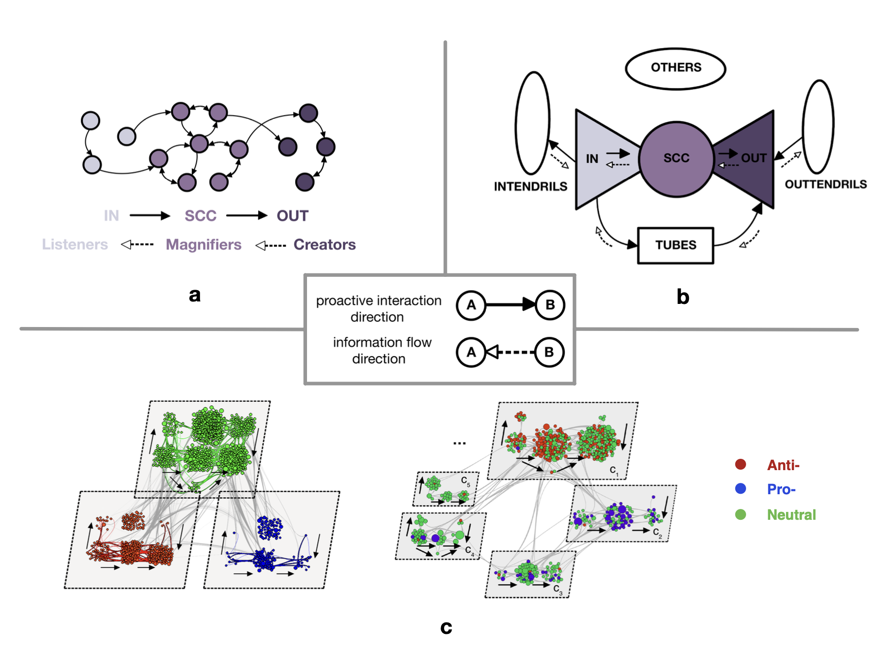

# Hi there 👋

My name is Yueting Han. I'm currently a PhD student from [MathSys CDT](https://warwick.ac.uk/fac/sci/mathsys/) at the University of Warwick. 

My research direction is network modelling of behavioural ecology in social media (e.g., Facebook, Twitter). Topics of particular interest are social network dynamics, mesoscale structure (e.g., community detection, bow-tie structure), agent-based modelling, network epidemiology. During my research, I pay particular attention to network visualisation.

&nbsp;

## Research Projects

### A. Measuring the co-evolution of online engagement with (mis)information and its visibility at scale
> Y. Han, P. Turrini, M. Bazzi, G. Andrighetto, E. Polizzi, and M. De Domenico, ["Measuring the co-evolution of online engagement with (mis)information and its visibility at scale"](https://arxiv.org/abs/2506.06106). (Preprint, 2025). 

In this paper, we measure the co-evolution of online "engagement" with (mis)information and its "visibility", where engagement corresponds to user interactions on social media, and visibility to fluctuations in user follower counts.

Using a scalable temporal network modelling framework applied to over 100 million COVID-related retweets spanning 3 years, we find that highly engaged sources experience sharp spikes in follower growth during major events (e.g., vaccine rollouts, epidemic severity), whereas sources with more questionable credibility tend to sustain faster growth outside of these periods. Our framework lends itself to studying other large-scale events where online attention is at stake, such as climate and political debates.

Data and relevant code are stored in GitHub Repo: [COVID_Retweets](https://github.com/YuetingH/COVID_Retweets). 

### B. Modelling and Predicting Online Vaccination Views using Bow-tie Decomposition
> Y. Han, M. Bazzi, and P. Turrini, ["Modelling and Predicting Online Vaccination Views using Bow-tie Decomposition"](https://royalsocietypublishing.org/doi/10.1098/rsos.231792). *Royal Society Open Science* 11, 231792. (2024)

This paper analyses the information exchange between Facebook pages with different vaccination stances (anti-, pro-, and neutral), from the lens of bow-tie structure — a network structure that groups users of information “creators”, “magnifiers”, “listeners”, etc. 

We uncover statistically different bow-tie structures associated with each vaccination group, and show its efficacy in predicting page fan count increase through both machine learning and mechanistic simulation methods. Grounded in real data with generative modelling frameworks, this work encourages further research on bow-tie structure, particularly in the realm of opinion dynamics.

Data and relevant code for this research work are stored in GitHub Repo: [BT_Vaccination_Views](https://github.com/YuetingH/BT_Vaccination_Views) and have been archived within the [Zenodo repository](https://zenodo.org/records/10513913).

### C. Graph-Based Anomaly Detection in Healthcare Data
>MathSys 2021-22 MSc group project at University of Warwick.

Our external partners at [Kirontech](https://www.kirontech.com/) offer a Health Insurance Platform that helps insurance payers deal with anomalies in their insurance claims. Healthcare data naturally involves a number of relevant interactions between different entities. Kirontech has yet to explore graph-based anomaly detection (GBAD) techniques.

The goal of this project is to adopt different GBAD methods on Kirontech's real-life dataset and provide evidence that graph-based data is useful to examine different anomalies.

See details in GitHub Organization: [Kirontech-Project](https://github.com/Kirontech-Project).

&nbsp;

## Technologies and Tools

### Network-related Programming
>I led support classes for network-related programming using Python in 4th-year / MSc-year Maths module MA4M4: Topics in Complexity Science (2022/23) at the University of Warwick. 

Some resources about public datasets and coding examples are documented in GitHub Repo: [MA4M4_2023](https://github.com/YuetingH/MA4M4_2023).

---

### Network Visualisation Resources
### A. Python Packages
- **nxviz**: https://github.com/ericmjl/nxviz
- **ForceAtlas2**: https://github.com/bhargavchippada/forceatlas2
- **curved_edges**: https://github.com/beyondbeneath/bezier-curved-edges-networkx

### B. Softwares
There are many visualization tools available for network analysis, which are detailedly evaluated [here](https://www.ncbi.nlm.nih.gov/pmc/articles/PMC5540468/).  Two softwares among them are used in this project. We particularly list the installation method for Ubuntu since it is our case.

#### 1. Gephi
- **Website**: https://gephi.org/
- **Technology**: C++, Qt
- **Platform**: Windows, Mac, Linux
- **Installation for Ubuntu**: https://lucahammer.com/2020/02/26/how-to-install-gephi-0-9-2-on-ubuntu-18-04

Gephi is an open-source graph analysis and visualization tool. We use it to manually adjust graph layout by applying **ForceAtlas2**. 

#### 2. Tulip
- **Website**: https://tulip.labri.fr/site/
- **Technology**: Java
- **Platform**: Windows, Mac, Linux
- **Installation for Ubuntu**: [Tulip_quickstart.pdf](Network_Visualization/Tulip_quickstart.pdf)

Tulip is another open-source graph visualisation and analysis tool. Here it is applied for **edge bundling**.

Explanations and other platforms for **edge bundling** are available [here](https://courses.isds.tugraz.at/ivis/surveys/ss2017/ivis-ss2017-g4-survey-edge-bundling.pdf).